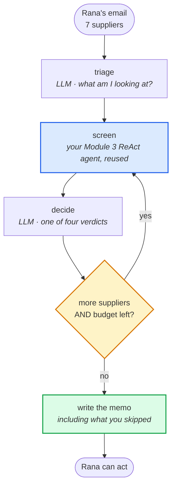
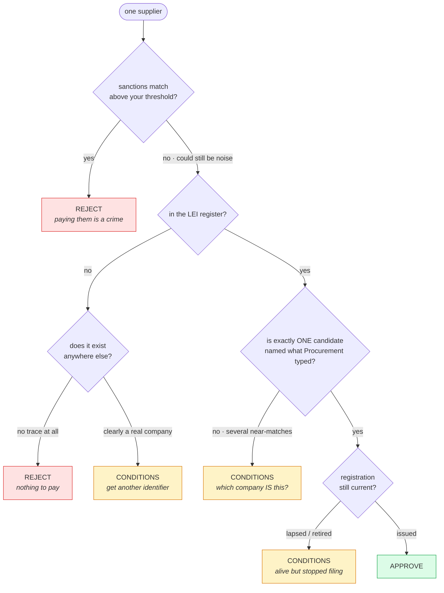

# The Vendor Onboarding Desk

### Module 3 Bridge Project · due before Friday · ~5–6 hours

---

## Why this one is different

Every agent you have built so far had one tool that always worked and one right
answer waiting at the end. The calculator never lied to you. The search either
found the page or it didn't.

**This one has no answer key.** It queries two live public registries — the same
ones banks and procurement teams actually use — about real companies. Some of
the evidence will contradict itself, and some of the most important findings
are things the registry *doesn't* say.

Your agent has to weigh that and **commit to a decision someone will act on
with €2.1m.**

That is the job. Not "can you call an API" — **can you build something that
decides.**

---

## The situation

Read `REQUEST.md`. Finance needs seven suppliers cleared before Thursday's
payment run. Your agent reads that email and returns a verdict for every one.



**The blue box is the agent you already built on Saturday.** Do not rebuild it —
hand it one supplier and let it decide what to look up.

**The amber diamond is the whole project.** Every agent you have written so far
ran to completion. This one has to stop early and tell the truth about it.


> ### 🔑 `MAX_LOOKUPS = 9`
>
> Seven suppliers, and only nine register lookups to establish who they
> actually are.
>
> **Sanctions screening does not come out of this budget.** Run it for every
> supplier, always — it is a legal obligation, not a judgement call, and it is
> cheap. What is rationed is the expensive work: *establishing which legal
> entity you are about to pay.*
>
> This is every real constraint compressed into one number — rate limits, cost,
> someone waiting. Your agent has to decide **what is worth checking, and what
> it is willing to not know.**
>
> On Saturday you asked what planning buys you when ReAct is cheaper.
> **This is the answer.** ReAct alone burns nine lookups on the first three
> suppliers and hands Rana nothing about the rest. A plan spends them where the
> ambiguity is.
>
> Nine is enough to do this well, with almost nothing to spare. Waste one on a
> lookup you already made and a supplier goes unverified.

---

## Your tools

| tool | what it is | who writes it |
|---|---|---|
| `sanctions_screen(name)` | live **OFAC** sanctions list — paying a listed entity is a criminal offence | ✅ written for you |
| `gleif_lookup(name)` | live **GLEIF** register — the global record of who a company legally is | ⚠️ **you write this** |
| `web_search(query)` | the one from Module 2 | ✅ written for you |

### The one you write

Open `registry_tools.py`, read the spec in the `gleif_lookup` docstring, then
read the real documentation:

**<https://www.gleif.org/en/lei-data/gleif-api>**

Three things in there will not match anything you have written before. Finding
them is the exercise. One of them is not about code at all — it is about what a
field *means*, and you will have to go and look it up.

When you think it works:

```bash
python verify_tools.py
```

Ten checks against companies with independently known answers. **Do not write a
single line of graph code until it prints `all 10 checks passed`.**

### ⚠ What `sanctions_screen` does and does not tell you

It returns the **closest names on the list and a similarity score**. It does
**not** tell you whether a supplier is sanctioned.

That is not a weakness of the tool — it is the actual problem. Fuzzy name
matching throws up near-misses constantly, because "Trading Company" resembles
a thousand other Trading Companies. Every bank on earth employs people whose
whole job is clearing false positives from screens like this.

**You will have to pick a threshold and defend it.** Too low and you refuse to
pay honest suppliers. Too high and you wire money to a sanctioned entity. Both
are real failures, and one of them is a crime.

---

## The four verdicts

| verdict | means | Rana's next move |
|---|---|---|
| **APPROVE** | real, current, clean | release the payment |
| **CONDITIONS** | pay, but only after something specific | you must say exactly what |
| **REJECT** | do not pay | you must say why, in one sentence she can repeat to Procurement |
| **INSUFFICIENT** | could not establish it | say precisely what document or check would settle it |

`INSUFFICIENT` is a real answer, not a cop-out. You learned that on the Evidence
Desk. Here it is the difference between an honest file and an audit finding.

### The reasoning your agent has to get right

This is **not** a flowchart to copy into your code — if it were, you would not
need an agent. It is the judgement you are teaching the model to make, and every
branch below is a real supplier in Rana's list.



> **Look at the two REJECT boxes.** They arrive by completely different routes,
> and only one of them involves a sanctions list. Now look at the branch that
> asks *"does it exist anywhere else?"* — **no registry can answer that.** That
> branch is why your agent needs more than one tool, and why it needs to decide
> for itself which one to reach for.


---

## What your agent must produce

```
SUPPLIER REVIEW · Thursday payment run · 7 suppliers · 9 lookups used

  REJECT        Al Wasel and Babel General Trading LLC
                Exact match on the OFAC sanctions list (programme: IRAQ2),
                similarity 1.00. Paying this entity is prohibited.
                → Rana: do not release. Refer to Legal, do not contact
                  the supplier directly.

  CONDITIONS    Siemens AG
                The register returns five different legal entities under
                this name — Siemens Energy AG, Siemens Healthineers AG and
                others — and none is named exactly "Siemens AG". We cannot
                tell which one Procurement means.
                → Rana: ask Procurement for the LEI or registration number
                  on the supplier's invoice before releasing.

  ...

  NOT CHECKED (budget)
                C & V Works ApS — lowest annual value, EU jurisdiction.
                Residual risk: accepted, not assessed.
```

That last block is not optional. **An agent that hides what it skipped is lying
by omission.** Naming it is what makes the memo trustworthy.

---

## ⚠ Four traps

Each one defeats a different lazy heuristic. All four are in the list.

**1 · "The register found it, so that's our supplier."**
One name returns **five different companies**, and none of them is named exactly
what Procurement typed. If your agent takes the first result, it will approve a
company nobody asked about — and it will sound completely confident doing it.
*This is the single most common failure in real supplier onboarding.*

**2 · "Not in the register means it doesn't exist."**
**Wrong, and expensive.** An LEI is mainly required for entities trading in
regulated financial markets. Plenty of entirely legitimate companies have never
needed one. Three suppliers on this list return nothing from the register — and
they do **not** all deserve the same verdict. The register alone cannot separate
them. Something else has to.

**3 · "A high similarity score means sanctioned."**
Perfectly legitimate suppliers on this list score anywhere from 0.71 to 0.81
against sanctions entries, purely because they share a word like "Trading" or
"Company" — and one of those noisy hits is against a genuinely alarming
programme. One supplier scores far higher still, for a real reason. Where you
draw the line is a judgement you have to make and justify, and a threshold that
looks safe will refuse an honest supplier.

**4 · "It's in the register and active, so it's fine."**
The register reports **two different status fields**, and they can disagree. A
company can be perfectly alive while its registration has quietly lapsed. Go
and find out what that means before you decide how much it matters — it is not
in your course notes.

---

## Setup

```bash
cd Module-03/bridge-project
pip install -r requirements.txt
cp .env.example .env          # then paste your OpenRouter key in
python verify_tools.py        # must pass before you build anything
```

Both registries are **free and need no key**. Only the LLM needs one. The
sanctions list is ~5 MB and is downloaded once, then cached.

---

## Hand in

**1 · `vendor_desk.py`** — your agent, in **LangGraph**.

> **Why not CrewAI?** Because this project is about control you hold yourself:
> a budget you check before every lookup, a loop-back edge you draw, and a
> router that reads without writing. CrewAI runs its agent loop *for* you —
> that is what makes it good for delegation and wrong for this. You would spend
> Thursday fighting the framework for control it deliberately hides.
>
> You also already have a compiled ReAct graph from the Module 3 lab. Your
> `screen` step should hand one supplier to it, not rebuild it.

**2 · `MEMO.md`** — the actual output of your agent on `REQUEST.md`.
Paste it exactly as produced. Do not tidy it up by hand; if it is ugly, that is
a finding.

**3 · `NOTES.md`** — one page, three questions:

> **a. Where did the budget force a real trade-off?**
> Which supplier did you decide not to fully check, and why that one?
> "I ran out" is not an answer. "I chose X over Y because…" is.
>
> **b. What sanctions threshold did you set, and why that number?**
> Show the score that made you pick it. Then answer honestly: what would it
> have cost you to be wrong in each direction?
>
> **c. Where did your agent nearly get it wrong?**
> Every one of you will hit at least one of the four traps. Which one, what did
> it output first, what did you change? *This is the most valuable paragraph
> in the document.*

### How to submit — same as the Evidence Desk

**[→ Open a submission issue](https://github.com/Alaaldin97/Agentic-AI-Bootcamp-Students/issues/new?template=module-03-vendor-desk.yml)**

Or from the repo: **Issues → New issue → "Module 3 Bridge Project — The Vendor
Onboarding Desk"**.

Put your name in the title, drag your files into the boxes, and answer the three
questions. The form will not let you submit with a box empty.

> ### ⚠ Do not attach your `.env` file.
> It contains your API key. Code files only — `.py`, `.md`, `.zip` all work.
> If you have ever pasted a key into your agent file, take it out before you
> attach it.

**Deadline: Friday, before the session starts.**


---

## Before you submit

- [ ] `verify_tools.py` prints all 10 passed
- [ ] All 7 suppliers have a verdict — including any you skipped
- [ ] Every **CONDITIONS** names the specific thing required
- [ ] Every **REJECT** gives Rana one sentence she can repeat to Procurement
- [ ] Your agent stayed inside 9 register lookups — print the count, prove it
- [ ] Run it **twice**. Same verdicts? If not, say so in `NOTES.md` — that is a
      real finding about non-determinism, not a bug to hide
- [ ] Nothing in `MEMO.md` is a fact your agent did not actually retrieve

---

## Stuck?

**`verify_tools.py` says only one candidate came back** — you are returning
`data[0]`. Return them all. The disambiguation is the agent's job, not the
tool's.

**Your filter seems to be ignored** — look at what happens to square brackets
in a URL. The request will still succeed, which is what makes this one nasty.

**Everything comes back INSUFFICIENT** — you are probably treating `NO_RECORDS`
and `LOOKUP_UNAVAILABLE` as the same thing. One means the register answered.

**Budget gone by supplier three** — you are running ReAct with no plan. Look
again at how `executor` in the Module 3 solution hands a *single* item to the
agent instead of letting it run free.

**It won't stop** — the budget counter is in the router. Routers cannot write.

**It crashed with `LengthFinishReasonError` halfway through** — the model
occasionally fails to close a valid structured object and the provider raises.
It is not your logic. **Wrap every model call so one bad reply cannot kill a run
that has already spent real lookups** — retry once, and if it still fails, carry
on and report that supplier honestly. An agent that dies at supplier five and
loses the four verdicts it already earned is worse than one that admits a gap.

---

## Optional stretch — only if the above is done

Rana replies:

> "great. we've got 340 suppliers on file — can you run it over all of them?"

Same nine lookups. **What has to change?**

You do not need to build it. Write the paragraph in `NOTES.md` about what breaks
and what you would do instead. That paragraph is Module 4.

---

## One last thing

Nobody will check your verdicts against an answer key, because there isn't one —
registries change, and your run will differ from mine.

What gets read is **`NOTES.md`**. Anyone can call two APIs. The person who can
say *"here is what I chose not to know, here is the line I drew, and here is
why"* is the one you would trust with the payment run.
